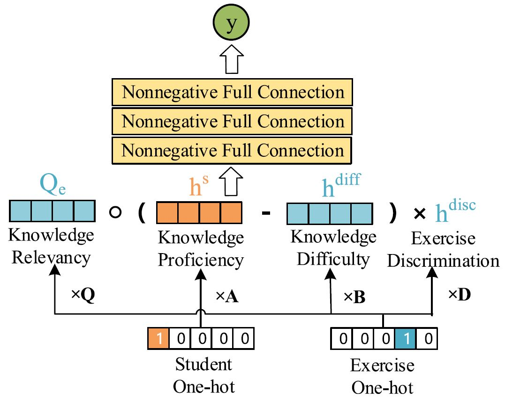

# Neural Cognitive Diagnosis Model

NCDM in this package is the implementation of the NeuralCDM model in paper: *[Neural Cognitive Diagnosis for Intelligent Education Systems](http://staff.ustc.edu.cn/~qiliuql/files/Publications/Fei-Wang-AAAI2020.pdf)* (also in paper [NeuralCD: A General Cogntive Diagnosis Framework](https://ieeexplore.ieee.org/abstract/document/9865139)). 


If this code helps with your studies, please kindly cite the following publication:

```
@article{wang2020neural,
  title={Neural Cognitive Diagnosis for Intelligent Education Systems},
  author={Wang, Fei and Liu, Qi and Chen, Enhong and Huang, Zhenya and Chen, Yuying and Yin, Yu and Huang, Zai and Wang, Shijin},
  booktitle={Thirty-Fourth AAAI Conference on Artificial Intelligence},
  year={2020}
}
```

or

```
@article{wang2022neuralcd,
  title={NeuralCD: A General Framework for Cognitive Diagnosis},
  author={Wang, Fei and Liu, Qi and Chen, Enhong and Huang, Zhenya and Yin, Yu and Wang, Shijin and Su, Yu},
  journal={IEEE Transactions on Knowledge and Data Engineering},
  year={2022},
  publisher={IEEE}
}
```


## Model description

NeuralCD is a neural-network-based general cognitive diagnosis framework, which uses neural network to learn the interactions among student abilities and exercise attributes from response data. NeuralCDM is a basic implementation of NeuralCD, where the neural network is multiple nonnegative full connections.



The model is implemented with Pytorch, and Adam optimizer is adopted for training.


## Parameters description

| Parameters | Type | Description                              |
| ---------- | ---- | ---------------------------------------- |
| meta_data  | dict | a dictionary containing all the userIds, itemIds, and skills. |
| hidd_dim1  | int  | the dimension of the first hidden layer. Default: 512 |
| hidd_dim2  | int  | the dimension of the second hidden layer. Default: 256 |


### Examples

```python
import pandas as pd
from EduCDM import NCDM
meta_data = {'userId': ['001', '002', '003'], 'itemId': ['adf', 'w5'], 'skill': ['skill1', 'skill2', 'skill3', 'skill4']}
model = NCDM(meta_data, 512, 256)

train_data = pd.DataFrame({'userId':[1,1,2,2,3,3], 'itemId': [1,2,1,3,2,3], 'skill': ["[1]", "[1,3]", "[1]", "[1,2,3]", "[1,3]", "[1,2,3]"], 'response': [1,1,0,1,1,0]})
test_data = pd.DataFrame({'userId':[1,2,3], 'itemId': [3,2,1], 'skill': ["[1,2,3]", "[1,3]", "[1]"], 'response': [1,1,0]})
model.fit(train_data, epoch=2)
predict = model.predict(test_data)
```


## Methods summary

| Methods           | Description                              |
| ----------------- | ---------------------------------------- |
| fit               | Fits the model to the training data.     |
| fit_predict       | Use the model to predict the responses in the testing data and returns the results. The responses are either 1 (i.e., correct answer) or 0 (i.e., incorrect answer). |
| fit_predict_proba | Use the model to predict the responses in the testing data and returns the probabilities (that the correct answers will be provided). |


